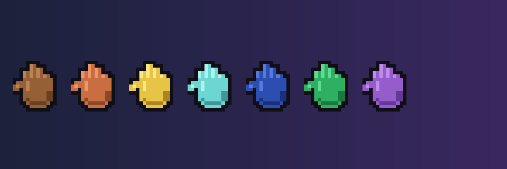

# MCPlusMod



A **Fabric** mod for **Minecraft 26.1** that expands the game with new equipment tiers, combat gloves, and building blocks.

- **Zero Mixin, zero third-party hard dependencies** — only Fabric Loader + Fabric API required, naturally low conflict potential
- **Bilingual** — full `zh_cn` / `en_us` localization
- **Datagen-driven** — all models, recipes, loot tables, tags, and language files are auto-generated

## Installation

1. Install [Fabric Loader](https://fabricmc.net/) and the matching [Fabric API](https://modrinth.com/mod/fabric-api)
2. Download `MCPlusMod-26.1.2-Fabric-x.x.x.jar` from [Releases](../../releases)
3. Drop the jar into `.minecraft/mods/`
4. Launch — no prerequisite mods needed

## Features

### Equipment & Tools (3 sets × 10 pieces = 30 items)
Three new material tiers, each with distinct balance:

| Material | Balance |
|---|---|
| **Lapis Lazuli** | Durability-focused; high enchantability, iron-level stats |
| **Emerald** | ≈ Diamond tier; trades off some durability for easier villager acquisition |
| **Amethyst** | Mid-tier between iron and diamond; crafted with **Amethyst Blocks** for elevated stats |

Each set includes: Helmet, Chestplate, Leggings, Boots, Sword, **Spear**, Pickaxe, Axe, Shovel, Hoe

- **Spear**: Vanilla spear mechanics — quick **Jab** (tap attack) and velocity-based **Charge** (hold use while closing on target). No throwing. Repairable with the corresponding material at an anvil.

### Combat Gloves (10 variants)
Leather / Chain / Copper / Iron / Gold / Diamond / Netherite / Lapis / Emerald / Amethyst

- **Main-hand only**: Armor and toughness bonuses apply only when held in the main hand; placing in armor or other slots grants no protection
- **Knockback punch**: Attacking a living entity flings it away from the player, with extra impact/fall damage; stronger tiers send targets farther
- **Enchantment restriction** (by design): Only **Knockback**, **Mending**, and **Unbreaking** can be applied — no Sharpness, Fire Aspect, Protection, or Thorns
- **Netherite Glove**: Upgrade from Diamond Glove at a Smithing Table (Netherite Ingot + Upgrade Template); not craftable directly

### Building Blocks
- **31 custom stone variants**: base / stairs / slab / wall + smooth / cut / chiseled variants
- **3 simplified sets**: End Stone / Purpur / Nether Brick (base + stairs / slab / wall)
- Mining tier: requires stone pickaxe or better

## Building from Source

```bash
cd fabric-mod
./gradlew runDatagen   # generate data first
./gradlew build        # then build (do NOT chain with runDatagen)
```

Output jar is at `fabric-mod/build/libs/`.

## Testing

In-game test checklist: see [TEST_REPORT.md](fabric-mod/TEST_REPORT.md)  
(Automated/static verification passed; manual in-game testing scheduled for after hardware upgrade.)

## License

MIT — see [LICENSE](LICENSE).
